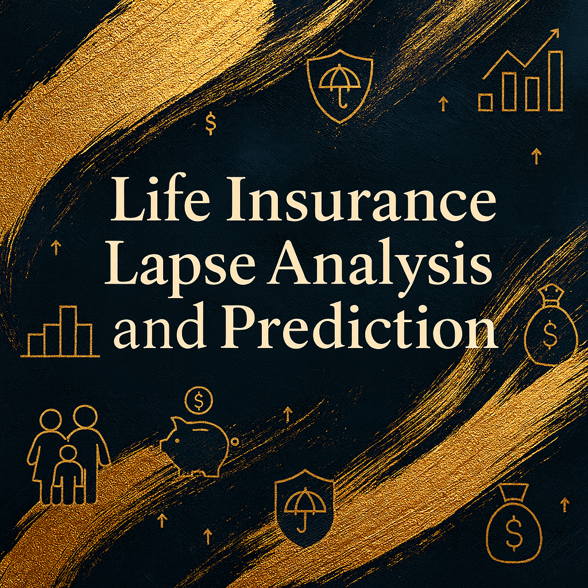
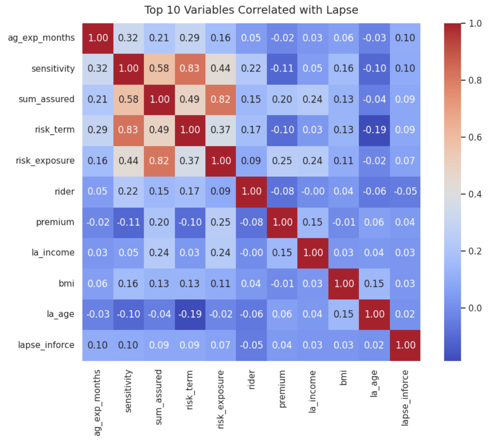

## ⚡ Executive Summary
- **Top Drivers**: Auto-debit status, sourcing channel (Online), first payment method, customer profile (income, education, city tier), premium size.  
- **Best Model**: HistGradientBoosting — ROC AUC **0.84**, Recall (lapse) **0.88**.  
- **Key Finding**: Policies without auto-debit are at **95% higher lapse risk**.  
- **Business Action**: Target High-Risk customers with proactive outreach & auto-debit promotion.  
- **Impact**: Improve persistency → +5% retention = up to **+25% profit uplift**.  

## 🌍 Why This Project Matter

In life insurance, **persistency is one of the most critical health indicators** of a portfolio.  
High lapse rates create operational inefficiencies, erode customer trust, and complicate long-term financial planning.  

Yet, insurers often struggle to answer two essential questions:
1. **What are the key drivers behind policy lapses?** – Are lapses driven more by payment methods, distribution channels, customer demographics, or product design?  
2. **Which customers are most at risk of lapsing?** – Can we anticipate lapse behavior early enough to intervene?

This project addresses both questions by combining **advanced analytics techniques** with **deep domain knowledge in life insurance**, offering a structured way to uncover hidden patterns and build predictive risk models that are interpretable and actionable.

---

## 1.Objectives🎯 
1. **Uncover Drivers of Lapse** → Understand key behavioral, demographic, and product factors.  
2. **Build Predictive Models** → Score customers by lapse probability.  
3. **Enable Business Action** → Segment into High/Medium/Low risk for targeted retention.  

---

## 2.Data📂
- **Source:** [*<u>Kaggle – Insurance Premium Data</u>*](https://www.kaggle.com/datasets/prachi13/insurance13m-persistency?resource=download&select=Train.csv)

- **Target**: `lapse_inforce` (1 = Lapse, 0 = Inforce).  
- **Key Variables**:
  - Payment behavior (auto-debit, payment_method, payment_frequency,  ...)  
  - Channel (sourcing, sub-channel,  ...)  
  - Customer profile (la_income, la_education, la_age, city_tier, ...)  
  - Policy attributes (premium, product_type, ...)  
  - Agent experience  

---
### Dataset Discription

The dataset contains **100,000 policy records** from an anonymized life insurance portfolio.  
It includes information on **policies, customers (life assured), agents, distribution channels, and policy status**.  
These features form the foundation for analyzing **drivers of policy lapse** and building **predictive models** to estimate lapse risk.  

- **Number of Rows**: 100,000  
- **Number of Columns**: 38  
- **Target Variable**: `lapse_inforce` (1 = Lapse, 0 = Inforce)  
- **Data Types**: Mixed (numeric, categorical, date, binary flags)  
- **Use Case**: Root cause analysis of lapse & predictive modeling for persistency improvement  

---

### 📋 Variable Dictionary

| Original (VAR..) | New Name             | Description                                                                 |
|------------------|----------------------|-----------------------------------------------------------------------------|
| VAR1             | id                   | Masked policy identifier (unique but anonymized, used as reference only).   |
| VAR2             | persistency_13m      | Historical 13-month persistency ratio of the mapped agent.                  |
| VAR3             | ag_branch            | Distribution branch of the mapped agent.                                    |
| VAR4             | alcohol              | Alcohol consumption declaration of the life assured.                        |
| VAR5             | premium              | Annualized premium amount of the policy.                                    |
| VAR6             | ag_exp_months        | Agent’s tenure (experience) in months.                                      |
| VAR7             | auto_debit           | Auto-debit flag (Yes/No) for premium payments.                              |
| VAR8             | bmi                  | Body Mass Index (BMI) of the life assured at application.                   |
| VAR9             | risk_exposure        | Total company risk exposure for the life assured.                           |
| VAR10            | sourcing_channel     | Channel through which the policy was sourced (e.g., Online, Bank).          |
| VAR11            | la_city              | City of residence of the life assured.                                      |
| VAR12            | contract_branch      | Branch where the policy contract was booked.                                |
| VAR13            | city_tier            | City tier classification (Metro, Tier-2, Tier-3).                           |
| VAR14            | la_age               | Age of the life assured.                                                    |
| VAR15            | la_education         | Education level of the life assured.                                        |
| VAR16            | la_gender            | Gender of the life assured.                                                 |
| VAR17            | la_income            | Declared income of the life assured.                                        |
| VAR18            | la_industry          | Industry/sector of the life assured.                                        |
| VAR19            | marital              | Marital status of the life assured.                                         |
| VAR20            | nationality          | Nationality of the life assured.                                            |
| VAR21            | occupation           | Occupation of the life assured (e.g., Salaried, Self-employed).             |
| VAR22            | policy_type          | Policy type: PAR, NON-PAR, or ULIP.                                         |
| VAR23            | distribution_partner | Specific distribution partner (e.g., HDFC Bank, Online aggregator).         |
| VAR24            | first_payment_method | Method of the first premium payment (Cash, Online, Cheque, etc.).           |
| VAR25            | product_category     | Product category (Protection, Savings, Investment, Pension, etc.).          |
| VAR26            | payment_frequency    | Premium payment frequency (Monthly, Quarterly, Annual, etc.).               |
| VAR27            | product_name         | Product name (masked if sensitive).                                         |
| VAR28            | login_date           | Date of policy application login.                                           |
| VAR29            | sensitivity          | Price sensitivity flag (1 = Yes, 0 = No).                                   |
| VAR30            | residential_status   | Residential status of the life assured (Owned, Rented, etc.).               |
| VAR31            | risk_term            | Risk cessation term (policy duration for coverage).                         |
| VAR32            | rider                | Rider opted flag (1 = Yes, 0 = No).                                         |
| VAR33            | smoker               | Smoker declaration of the life assured.                                     |
| VAR34            | la_state             | State of residence of the life assured.                                     |
| VAR35            | sub_channel          | Sub-distribution channel (e.g., HDFC Bank branch, Online partner).          |
| VAR36            | sum_assured          | Sum assured (coverage amount payable upon insured event).                   |
| VAR37            | operation_zone       | Company-defined operational zone/region.                                    |
| VAR38            | lapse_inforce        | **Target variable**: Policy status (1 = Lapsed, 0 = Inforce).               |

---
### Sample Data Preview

The dataset contains **100,000 rows and 38 columns**.  
Below is a sample snapshot of the first few records after variable renaming:

| id       | persistency_13m | ag_branch             | alcohol | premium    | ag_exp_months | auto_debit | bmi   | risk_exposure | sourcing_channel     | la_city     | contract_branch       | city_tier | la_age | la_education                       | la_gender | la_income   | la_industry        | marital | nationality | occupation | policy_type | distribution_partner | first_payment_method                 | product_category | payment_frequency | product_name                    | login_date | sensitivity | residential_status | risk_term | rider | smoker | la_state      | sub_channel | sum_assured  | operation_zone | lapse_inforce |
|----------|-----------------|-----------------------|---------|------------|----------------|------------|-------|---------------|----------------------|-------------|-----------------------|-----------|--------|------------------------------------|-----------|-------------|-------------------|---------|-------------|------------|-------------|----------------------|--------------------------------------|-----------------|------------------|---------------------------------|------------|-------------|-------------------|-----------|-------|--------|--------------|-------------|--------------|----------------|---------------|
| 19981651 | 0.8773          | Ghaziabad - Rajnagar  | NaN     | 622,010.00 | 77.00          | Y          | NaN   | 0.00          | HDFC BANK            | Ghaziabad   | Ghaziabad - Rajnagar  | Tier II   | 46.00  | Graduation                         | Male      | 7,200,000.00| Legal And Justice | Married | Indian      | Salaried   | Par         | HDFC BANK            | DD                                   | Pension         | Annual           | HDFC Life Personal Pension Plus | 2018-09-01 | 0           | Resident Indian   | 14.00     | 1     | NaN    | Uttar Pradesh | HDFC BANK   | 7,901,018.00 | North 2        | 1             |
| 20524842 | 93.47           | Delhi - Asaf Ali Road | N       | 7,157.00   | 33.00          | Y          | 16.23 | 10,000,000.00 | HDFC BANK            | Bangalore   | Delhi - Nehru Place   | Tier I    | 24.00  | Graduation                         | Female    | 495,000.00  | Trading           | Single  | Indian      | Salaried   | Non Par     | HDFC BANK            | ECS,SI                               | Protection      | Annual           | HDFC Life Click 2 Protect 3D+   | 2018-07-07 | 1           | Resident Indian   | 40.00     | 1     | N      | Karnataka     | HDFC BANK   | 10,000,000.00| North 1        | 1             |
| 20360827 | 86.61           | Mumbai - Corporate    | Y       | 27,426.00  | 99.00          | N          | 20.83 | 18,000,000.00 | EDM                  | Mumbai      | Mumbai - HUB          | Tier I    | 33.00  | B.E.                                | Male      | 2,500,000.00| Insurance         | Married | Indian      | Salaried   | Non Par     | NaN                  | Online Credit/Debit Card/Teles Sales | Protection      | Annual           | HDFC Life Click 2 Protect 3D+   | 2018-04-23 | 1           | Resident Indian   | 30.00     | 1     | N      | Maharashtra   | EDM         | 30,000,000.00| NaN            | 1             |
| 21025282 | NaN             | Mumbai - Borivali     | NaN     | 33,493.00  | 3.00           | Y          | NaN   | 350,000.00    | Other Banks & CA     | Thane       | Mumbai - Borivali     | Tier I    | 28.00  | Diploma in Electrical Engineering  | Male      | 450,000.00  | Consultant        | Single  | Indian      | Salaried   | Par         | RBL Bank Ltd         | Online Credit/Debit Card/Teles Sales | Savings         | Annual           | HDFC Life Uday                 | 2018-12-31 | 0           | Resident Indian   | 12.00     | 0     | NaN    | Maharashtra   | Ratnakar Bank | 212,857.00   | West           | 1             |
| 19982717 | 0.8307          | Mumbai - Corporate    | NaN     | 12,335.00  | 32.00          | N          | NaN   | 58,326.00     | HDFC BANK            | Pandharpur  | Mumbai - HUB          | Tier III  | 37.00  | B.A.                                | Male      | 250,000.00  | Sales & Marketing | Married | Indian      | Salaried   | Par         | HDFC BANK            | Online Credit/Debit Card/Teles Sales | Savings         | Annual           | HDFC Life ClassicAssure Plus    | 2018-01-17 | 0           | Resident Indian   | 10.00     | 1     | NaN    | Maharashtra   | HDFC BANK   | 116,653.00   | NaN            | 1             |

---
## 3.Methodology🛠
1. **EDA**: lapse rate distribution, CI analysis, bivariate comparisons.  
2. **Feature Importance**: Logistic L1 (signed coef), Tree Ensembles (RF, ET, HGB), Permutation Importance.  
3. **Predictive Modeling**: HGB, RF, ET, Logistic L1.  
4. **Evaluation Metrics**: ROC AUC, Accuracy, Balanced Accuracy, Precision, Recall, F1.  

---
### **Heatmap Correlation**
The heatmap below shows the correlation matrix of the top 10 variables most related to policy lapse.  
Key observations:  
- **Strong positive correlations** exist between `sensitivity`, `risk_term`, and `sum_assured`, which may indicate overlapping information.  
- `lapse_inforce` exhibits only **weak direct correlations** with single variables, implying that lapse is likely driven by multiple factors combined.  
- This analysis highlights the importance of considering feature interactions and potential multicollinearity when building predictive models.

---

## 4.Results📊
### Premium Collection & Payment Rails
Payment Frequency × Product Category (row = 100%)

---

### Distribution Channels & Execution Discipline

---

### Risk Profile & Coverage Scale

 

---

### Demographic Profile & Payment Discipline

---

### 🔑 Top 10 Drivers of Lapse

| Rank | Feature                          | Avg. Norm. Importance | # Models Agree | Signed Coef | Direction  |
|------|----------------------------------|-----------------------|----------------|-------------|------------|
| 1    | auto_debit_N                     | 0.95                  | 5              | -0.70       | ↓ Risk     |
| 2    | auto_debit_Y                     | 0.78                  | 4              | 0.70        | ↑ Risk     |
| 3    | sourcing_channel_e_Online        | 0.25                  | 5              | 0.76        | ↑ Risk     |
| 4    | first_payment_method_e_encoded   | 0.24                  | 5              | 0.06        | ↑ Risk     |
| 5    | la_education_e_encoded           | 0.22                  | 5              | 0.10        | ↑ Risk     |
| 6    | ag_exp_moths_e_encoded           | 0.22                  | 5              | 0.12        | ↑ Risk     |
| 7    | premium_e_encoded                | 0.18                  | 5              | 0.03        | ↑ Risk     |
| 8    | city_tier_encoded                | 0.17                  | 5              | 0.11        | ↑ Risk     |
| 9    | la_income_e_encoded              | 0.17                  | 5              | 0.13        | ↑ Risk     |
| 10   | la_age_e_encoded                 | 0.14                  | 5              | 0.03        | ↑ Risk     |

---

### 📊 Model Metrics

| Model               | ROC AUC | Accuracy | Balanced Accuracy | F1   | Precision | Recall |
|---------------------|---------|----------|-------------------|------|-----------|--------|
| HistGradientBoosting | **0.85** | 0.80     | 0.70              | 0.87 | 0.85      | **0.90** |
| Logistic_L1          | 0.84    | 0.75     | 0.78              | 0.81 | **0.94**  | 0.72   |
| RandomForest         | 0.84    | 0.80     | 0.68              | 0.87 | 0.84      | 0.90   |
| ExtraTrees           | 0.81    | 0.79     | 0.67              | 0.87 | 0.84      | 0.89   |

**Insight**: Auto-debit, sourcing channel, and payment method dominate risk factors.  

---

### ROC AUC between Models

**Insight:**  
The **HistGradientBoosting** model achieved the highest discriminative power with a **ROC AUC of 0.84**, followed closely by **Logistic Regression (0.82)** and **Random Forest (0.81)**. **Extra Trees (0.79)** trailed slightly, indicating lower stability.  

Overall, all models demonstrated strong predictive capability (**>0.79 AUC**), with **HGB emerging as the most reliable classifier** for lapse risk prediction.

---

### ROC Curve (Model Comparison)

**Insight**: HGB clearly dominates in distinguishing lapse vs. inforce.  

---

### Precision–Recall Curve (Best Model: HGB)
  
**Insight**: At threshold ~0.5, Precision=0.86, Recall=0.88. Business can tune threshold:  
- Lower threshold → higher recall, catch more lapse risk.  
- Higher threshold → higher precision, fewer false alarms.  

---

### Confusion Matrix (HGB – Threshold=0.5)
  
**Insight**:  
- True Lapse caught: **13.5k** (88%).  
- False Alarms: ~2.2k inforce contracts flagged incorrectly.  

---
## **Summary**

| Analysis Axis                 | Hotspot / Segment                        | Lapse Count (est. from chart)                            | Share / Rate (%)                       | Key Insights                                                                                                                                                                                                                                                                                                                                                                  |
| ----------------------------- | ---------------------------------------- | -------------------------------------------------------- | -------------------------------------- | ----------------------------------------------------------------------------------------------------------------------------------------------------------------------------------------------------------------------------------------------------------------------------------------------------------------------------------------------------------------------------- |
| **Product × Payment Freq.**   | **Annual × (Investment + Savings)**      | \~54,819 (within 64,524 Annual)                          | Annual = 84.1% of total lapse          | (1) Annual accounts for **84.1%** of total lapses ⇒ this is the largest “leakage pool.” (2) Within Annual, **Investment + Savings ≈ 54.8k (\~83%)** ⇒ a 10–15% reduction here alone retains \~5.5k–8k contracts. (3) Pension is small in volume (663) but lapse rate reaches **90.2%**, indicating a fragile product though not yet a priority due to low base.         |
| **Auto-debit × First Payment Method**          | Auto-debit = Y, Online Bill / Card       | Y = 48,257 (95.5% rate), Online-Bill 16,111 (rate 78.8%) | Inforce extremely low                  | (1) Auto-debit = **Y correlates with 95.5% lapse** ⇒ highly likely the flag represents “collection attempts after due date” rather than true enrollment. (2) **Online-Bill rail shows the highest lapse rate (78.8%)**, followed by Card \~76.9% ⇒ rails are the choke point. (3) Auto-debit = N is paradoxically safer (56.5% rate) than Y.                            |
| **Occupation × Sum Assured**  | Salaried + Self-employed (Medium/Low SA) | Salaried 39,248; Self-employed / Business \~27,729       | \~87% of total occupational lapse      | (1) **Salaried segment contributes \~39k lapses**, combined with Self-employed/Business \~27k ⇒ \~87% of total lapses by occupation. (2) These are precisely the segments expected to pay regularly, yet are at risk ⇒ structured payroll-linked / cashflow-aligned collection is critical. (3) Other categories are minor but prove lapse is not occupation-exclusive. |
| **Risk Exposure × Premium**   | Ultra exposure (all premium bands)       | \~74,163                                                 | Ultra dominates majority               | (1) **Ultra Risk Exposure explains nearly all lapses**, making it the #1 driver. (2) Even Medium and Low premiums under Ultra exposure show high lapse ⇒ risk is not confined to large-ticket cases. (3) Low/Medium exposure almost negligible ⇒ rescue capacity must be focused exclusively on Ultra.                                                                  |
| **Zone × City Tier**          | Unknown zone + Tier III                  | Unknown = 47,632 (36.6%, \~92.8% rate)                   | East (Tier III = 65.1%), North2 (60%)  | (1) **Unknown Zone = 36.6% of total lapses, \~92.8% rate** ⇒ data quality failure severely distorts geographic insight. (2) Where data is available, **Tier III dominates consistently** (East 65.1%, North2 60%) ⇒ small-town / rural lapse hotspots. (3) West is an exception with **Tier I at 41.4%** ⇒ points to channel-specific dynamics.                         |
| **Education**                 | Bachelor + Highschool                    | Bachelor 30,364; Highschool 15,667                       | Top 2 = >60% of total lapses           | (1) **Bachelor degree alone accounts for \~30k (\~40%) lapses**, the largest single group. (2) Combined with Highschool (\~15.6k), the two groups represent >60% of lapses ⇒ primary target cohorts for retention communication. (3) Smaller categories (Doctorate / Professional) still lapse, proving even “high-education” customers are not immune.                 |
| **Policy Type × Sub-channel** | UL via HDFC BANK                         | UL total \~37,540; HDFC BANK share = 68.4% of UL         | One channel accounts for outsized risk | (1) UL contributes \~37.5k lapses, of which **68.4% are sourced through HDFC Bank** ⇒ one single channel concentrates systemic risk. (2) Par & Non-Par lapses spread more evenly across EDM/Agency ⇒ channel-specific retention playbooks required. (3) Accountability at HDFC Bank alone could reduce >1k lapses with small rate improvement.                          |
| **Age × Risk Term**           | Middle + Young, ≤20 years risk term      | Middle: 52.8% lapse share; Young: 45.1%                  | Short-term contracts dominate lapses   | (1) **Middle-aged group explains \~53% lapses**, followed by Young at \~45%. (2) Lapses cluster in **short-term contracts ≤20 years** ⇒ reflects payment discipline rather than affordability of long-term cover. (3) Teenagers show high lapse % but negligible absolute count ⇒ not a priority for intervention.                                                      |
| **First Payment Method**      | Online-Bill & Card                       | Online-Bill 16,111; Card \~13k                           | \~77–79% lapse rate                    | (1) **Online-Bill has the highest rate (78.8%)** among all methods. (2) Card (76.9%) and Cheque (76.8%) also show instability ⇒ “high-fail” rails. (3) Transfer and Others record lower rates (\~73–74%) ⇒ migrating customers to these methods can reduce risk materially.                                                                                             |
| **Sub-channel × Agency Exp.** | EDM / OL-HDFC Bank                       | EDM share \~49.1%; OL-HDFC Bank \~86.8%                  | High lapse in senior-heavy channels    | (1) EDM and OL-HDFC show **exceptionally high lapse concentration (49% / 86.8%)**, a paradox as seasoned channels perform worse. (2) Agency & HDFC Sales exhibit high lapse among early-tenure reps ⇒ need structured coaching + first-year playbooks. (3) Suggests urgent **audit of pitch quality and collection process** in senior-heavy sub-channels.              |

---

## **📊 Strategic Insights & Recommendations**
| Dimension / Driver                 | Data Evidence                                                                           | Model Alignment                                                                     | Strategic Actions                                                                                                                                                                       |
| ---------------------------------- | --------------------------------------------------------------------------------------- | ----------------------------------------------------------------------------------- | --------------------------------------------------------------------------------------------------------------------------------------------------------------------------------------- |
| **Auto-debit flag**                | Auto-debit=Y lapse **95.5%**, paradoxically worse than N=56.5%.                         | Auto-debit\_Y ↑ risk (coef +0.70), Auto-debit\_N ↓ risk (coef -0.70).               | Audit **auto-debit process**: likely capturing failed attempts vs. true enrollment. Re-engineer debit logic, redesign fallback rails, and enforce **real-time validation** of mandates. |
| **Payment Method**                 | Online-Bill lapse **78.8%**, Card **76.9%**, Cheque **76.8%**.                          | First Payment Method = ↑ risk (coef +0.06).                                         | Shift new business to **lower-risk rails** (e.g., ECS/Transfer ≤73%). Mandate **multi-rail backup** for high-value policies.                                                            |
| **Sourcing Channel (Online/Bank)** | HDFC Bank = **68.4% of UL lapses**; EDM = **49%**; OL-HDFC = **86.8%**.                 | Sourcing\_channel\_Online ↑ risk (coef +0.76).                                      | Immediate **channel-level accountability**. Incentive redesign: tie persistency to **advisor payout**. Deploy **channel risk-adjusted pricing**.                                        |
| **Product × Payment Freq.**        | Annual frequency = **84.1% lapses**; within this, Investment+Savings ≈ **54.8k (83%)**. | Premium (encoded) ↑ risk; Payment frequency (Annual) strongly correlated in EDA.    | Redesign product cashflows: convert **Annual → Monthly/Quarterly**. Pilot **auto-split installment** to reduce large-ticket annual shocks.                                              |
| **Risk Exposure × Premium**        | Ultra exposure = **\~74.1k lapses**, regardless of premium band.                        | Risk\_exposure strongly correlated (0.82 with sensitivity, 0.83 with risk\_term).   | **Ultra exposure = systemic risk pool.** Apply **risk-based underwriting corrections**, early-warning scoring, and **targeted retention outreach** before 6M persistency check.         |
| **Occupation × Sum Assured**       | Salaried **39k** + Self-employed **27.7k** = **87% lapses**.                            | La\_income & Sum\_assured correlated with lapse (\~0.24, 0.58 respectively).        | Rollout **payroll-linked debit** for salaried. For self-employed, align collection with **cashflow cycles** (quarterly, business-linked).                                               |
| **Education**                      | Bachelor **30.3k (40%)**, Highschool **15.6k** ⇒ combined >60% lapses.                  | La\_education encoded ↑ risk (coef +0.10).                                          | Tailored financial literacy campaigns. Targeted **“persistency nudges”** for Bachelor/Highschool segments.                                                                              |
| **Age × Risk Term**                | Middle (52.8%) + Young (45.1%) dominate; short-term ≤20 years contracts cluster lapses. | La\_age encoded ↑ risk (coef +0.03); Risk\_term correlated with sensitivity (0.83). | Re-price short-term contracts; design **commitment rewards** for mid-young age groups (e.g., cashback on persistency).                                                                  |
| **City Tier / Zone**               | Unknown zone = **36.6% lapses, 92.8% lapse rate**; Tier III = **60–65%** consistently.  | City\_tier encoded ↑ risk (coef +0.11).                                             | **Fix data quality (Unknown Zone = 47k contracts).** Deploy rural Tier III-specific engagement models (local partner servicing).                                                        |
| **Agent Experience (Vintage)**     | Senior-heavy sub-channels (EDM 49%, OL-HDFC 86.8%) have **unexpectedly high lapse**.    | Ag\_exp\_months encoded ↑ risk (coef +0.12).                                        | **Retrain senior advisors**; deploy **first-year retention playbooks** for junior reps. Continuous monitoring of advisor persistency with **branch-level dashboards**.                  |

---  

## 5.Business Implications🚀 

- **Auto Debit (Critical Weakness)**  
  - Policies flagged with Auto-debit=Y exhibit **95.5% lapse rate**, paradoxically *higher* than N=56.5%.  
  - This anomaly signals **systemic failure in debit infrastructure** (failed attempts misclassified as enrollments).  
  - **Business Impact**: ~48,000 contracts lost via failed auto-debit → rescuing even **10% (~4,800)** yields millions in retained premium.  

- **Digital / Online Channels (High-Risk Distribution)**  
  - **HDFC Bank UL lapses = 68.4%** of all UL contracts; EDM lapse share = **49%**; OL-HDFC = **86.8%**.  
  - Over-concentration in a single bancassurance channel creates **systemic dependency risk**.  
  - **Business Impact**: Reducing lapse in HDFC Bank UL portfolio by just **3% (~1,100 policies)** equals a direct uplift of ~$8–10M in premium persistency.  

- **Socio-Demographic Factors**  
  - **Bachelor (30.3k) + Highschool (15.6k)** = **>60% of total lapses**.  
  - **Tier III cities** dominate lapse share (East=65%, North2=60%); unknown zones = **92.8% lapse rate** due to data quality gaps.  
  - **Business Impact**: Prioritized engagement with Bachelor/Highschool cohorts + rural Tier III zones can save **10–12k contracts/year**.  

- **Agent Experience (Paradox of Vintage)**  
  - EDM (49.1%) and OL-HDFC Bank (86.8%) show *worse* lapse performance than junior agents.  
  - Suggests **misaligned incentives** and **pitch quality erosion** in mature channels.  
  - **Business Impact**: Correcting advisor persistency at EDM alone could cut lapse volume by **3–5k annually**.  

### 🎯 Retention Strategy by Risk Score
- **High Risk (p ≥ 0.70; ~30% of portfolio)**  
  Intensive interventions: outbound calls, in-person visits, mandatory **auto-debit re-validation**.  
  → Expected save: **20–25% of high-risk lapses (~6–7k contracts)**.  

- **Medium Risk (0.50 ≤ p < 0.70; ~40% of portfolio)**  
  Early nudges: **SMS/email reminders**, **loyalty-linked cashback** for on-time premium.  
  → Expected save: **10–15% (~4–5k contracts)**.  

- **Low Risk (<0.50; ~30% of portfolio)**  
  Standard retention: awareness campaigns + **gamified persistency tracking**.  
  → Maintain base persistency while freeing resources for high-risk saves.  

---

## 6.Limitations & Next Steps⚠️ 

- **Limitations**  
  - Data from one insurer; risk patterns may not generalize across **markets or regulatory environments**.  
  - Macroeconomic shocks (COVID, inflation, recessions) not explicitly modeled.  
  - Channel-specific incentives opaque: cannot yet isolate **human vs. product-driven lapses**.

- **Next Steps (Execution Path)**  
  1. **Deploy lapse scoring model** (HGB, ROC AUC=0.85, Recall=0.90) into CRM.  
  2. **Quarterly model monitoring** for drift in risk factors (especially auto-debit & online channels).  
  3. Enrich dataset with **external features**: macro indicators, payment system downtime, competitor benchmarks.  
  4. **Pilot retention squads** for high-risk Tier III + Bachelor/Highschool segment; measure ROI of targeted saves.  

---

## 🛠 Tech Stack

- **Data Wrangling**: pandas, numpy  
- **Visualization**: seaborn, matplotlib, plotly (heatmaps, lapse distribution, cohort tracking)  
- **ML Models**: Logistic Regression (coef interpretability), Random Forest & Extra Trees (non-linear patterns), HistGradientBoosting (best ROC AUC=0.85, Recall=0.90)  
- **Pipeline**: sklearn + xgboost, modularized for CRM integration  

---

## 📌 Takeaway (Executive-Level)

This project proves that **lapse prediction is not just analytics — it is revenue protection**.  

- We uncovered **3 systemic fault lines**:  
  1. **Payment infrastructure failures** (auto-debit + high-fail rails).  
  2. **Channel concentration risk** (HDFC Bank UL portfolio).  
  3. **Demographic-product mismatches** (Bachelor/Highschool, Tier III, short-term contracts).  

- Predictive models achieved **>0.79 ROC AUC across all classifiers**, validating that these drivers are robust, not noise.  

- **Quantifiable ROI**: By executing targeted retention on the top risk cohorts, the insurer could realistically **save 12–16k contracts/year**, translating into **$25–30M retained premium**.  

👉 The outcome: **boosted persistency, reduced new acquisition spend, and strengthened long-term trust with customers**.  

